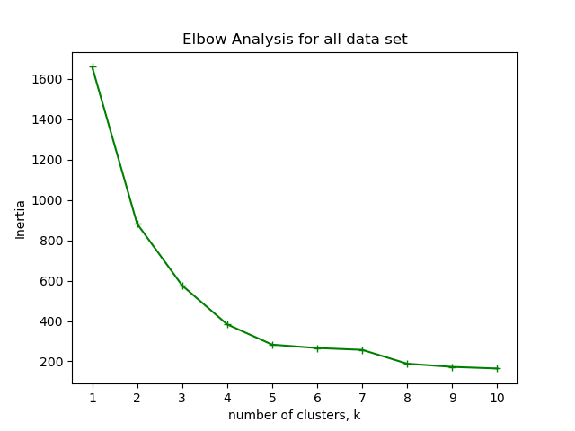

# 🐧 Penguin Clustering Analysis

_Illustration source: [@allison_horst](https://github.com/allisonhorst/penguins)_

Welcome to my penguin clustering project! In this analysis, I explored real biological data collected in Antarctica to uncover natural groupings among penguins — potentially even hinting at the discovery of a new species! 🧬

---

## 📦 Dataset Overview

The dataset (`penguins.csv`) was collected by Dr. Kristen Gorman and the Palmer Station, Antarctica LTER. It contains biometric measurements of penguins from three known species: **Adelie**, **Chinstrap**, and **Gentoo** — although species labels were not included.

 

These species are known to inhabit the region, and the goal of this project is to uncover natural groupings based on their physical measurements.

### 📊 Features

The key biometric features recorded in the dataset are listed below:

The dataset includes several biometric features measured from each penguin. The image above shows how **culmen length** and **culmen depth** are defined — terms used in the dataset to describe bill dimensions.

| Column              | Description                                   |
|---------------------|-----------------------------------------------|
| `culmen_length_mm`  | Length of the penguin's bill (culmen) in mm   |
| `culmen_depth_mm`   | Depth of the bill (culmen) in mm              |
| `flipper_length_mm` | Flipper length in mm                          |
| `body_mass_g`       | Body mass in grams                            |
| `sex`               | Biological sex (`MALE` / `FEMALE`)            |

---

## 🧹 Data Cleaning

To prepare the dataset for analysis:

- I confirmed that there were no missing values in the dataset.
- I created a shorter alias `'df'` for the original DataFrame `'penguins_df'`.
- I converted the `'sex'` column into binary dummy variables (`sex_MALE`, `sex_FEMALE`) using `pd.get_dummies`.

This ensured that all features used for clustering were numerical and complete.

---

## ⚖️ Standardisation

I standardised all numerical features using `StandardScaler` from `scikit-learn`. This transformed the data so that each feature had a mean of 0 and a standard deviation of 1, ensuring that features like body mass or flipper length didn’t dominate the clustering due to differences in scale.

---

## 📈 Elbow Analysis

To determine the optimal number of clusters (`k`), I applied the **Elbow Method**. I plotted the model’s **inertia** (within-cluster sum of squares) across values of `k` from 1 to 10.

> 

There was a clear drop in inertia up to `k = 5` or `k = 6`, suggesting meaningful separation in those cases. A subtle inflection between `k = 7` and `k = 8` hinted at potential deeper structure in the data.

---

## 🧪 Clustering with `k = 5`

I proceeded by clustering the standardised data using `KMeans` with `k = 5`. After fitting the model, I assigned the resulting clusters to each penguin in the dataset.

Here’s a random sample of penguins from the clustered dataset:

| Index | culmen_length_mm | culmen_depth_mm | flipper_length_mm | body_mass_g | sex_MALE | label |
|-------|------------------|------------------|--------------------|--------------|-----------|--------|
| 159   | 45.9             | 17.1             | 190.0              | 3575.0       | 0.0       | 2      |
| 67    | 35.5             | 17.5             | 190.0              | 3700.0       | 0.0       | 2      |
| 75    | 36.7             | 18.8             | 187.0              | 3800.0       | 0.0       | 2      |
| 166   | 48.5             | 17.5             | 191.0              | 3400.0       | 1.0       | 4      |
| 270   | 43.2             | 14.5             | 208.0              | 4450.0       | 0.0       | 3      |

---

## 🔍 Visualising Cluster Distributions

To better understand how each feature contributed to the clustering, I created scatter plots showing the distribution of each variable across the five clusters.

> 

These visualisations helped highlight how flipper length, culmen size, and body mass varied between clusters — possibly corresponding to different species or sex-based differences.

---

## 🐧 Plot Twist!

When I plotted the `sex_MALE` variable alongside the cluster labels, something unexpected showed up — in **Cluster 4**, both males ♂️ and females ♀️ appeared! 🤯

> 

This overlap might be due to **small males** from one species clustering with **larger females** from another. It raised a compelling question: Had I completely missed the third species — or maybe even stumbled upon a **fourth**? 🔍🐧

Curious, I tried clustering again with `k = 6`, hoping the mix would disappear. It didn’t. Same result at `k = 7`. So I pushed it further — **what about `k = 8`**?

> 

At `k = 8`, the sex-based overlap seemed to vanish. Could this mean there are actually **four species**, not just three? 🤔 To dig deeper, I used **t-SNE** to project the clusters into two dimensions and get a better sense of how the groups separate visually. :chart_with_upwards_trend:

In the t-SNE map with **five clusters**, we can clearly see five distinct groups. One of them shows a **subtle internal separation**, which might reflect the similarity between two subgroups the model wasn’t able to split. There's also some evidence of the algorithm **stretching the borders** of another cluster and misplacing a few points. 📏📊

> 

Now take a look at the t-SNE map for **`k = 8`**...

> 

Here, the map looks **messy**. Several clusters are overlapping or spread in ways that don't align with clear group boundaries. What initially looked like a new species turns out to be **just noise or natural variation**. :chart_with_downwards_trend:

So, are there four species? Most likely not. What we saw was probably just **intra-species variation**, especially between males and females that share similar features. 🙃

Still — a fun detour, and a reminder that sometimes, the data keeps its secrets. 🧬🐧💥

---

## 📌 Conclusion

This project demonstrates how unsupervised learning can uncover natural groupings within real-world biological data. Using only physical measurements — and no species labels — I was able to:

- Identify meaningful clusters of penguins.
- Reveal potential overlaps and latent structure.
- Open the door to future biological questions (and possibly discoveries 🧪).

---

## 📁 Repository Contents

- `notebook.ipynb` – Main Jupyter notebook with the full clustering analysis  
- `README.md` – Project overview and explanation  
- `/data` – Contains the penguin dataset (`penguins.csv`)  
- `/plots` – Visualisations generated during the analysis  
- `/figures` – Illustrative images used in the README and notebook  

---

* ## 🙌 Acknowledgements

- **Dataset**: [Palmer Station LTER](https://pal.lternet.edu/)
- **Illustration**: [Allison Horst – penguins art](https://github.com/allisonhorst/penguins)
- Built with ❤️ using Python, pandas, scikit-learn, and matplotlib
